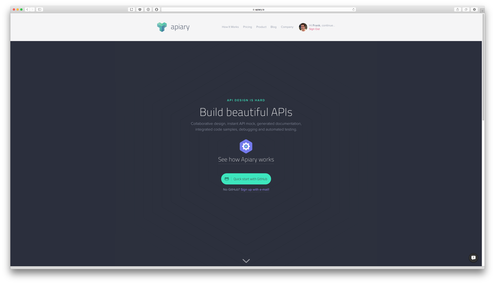
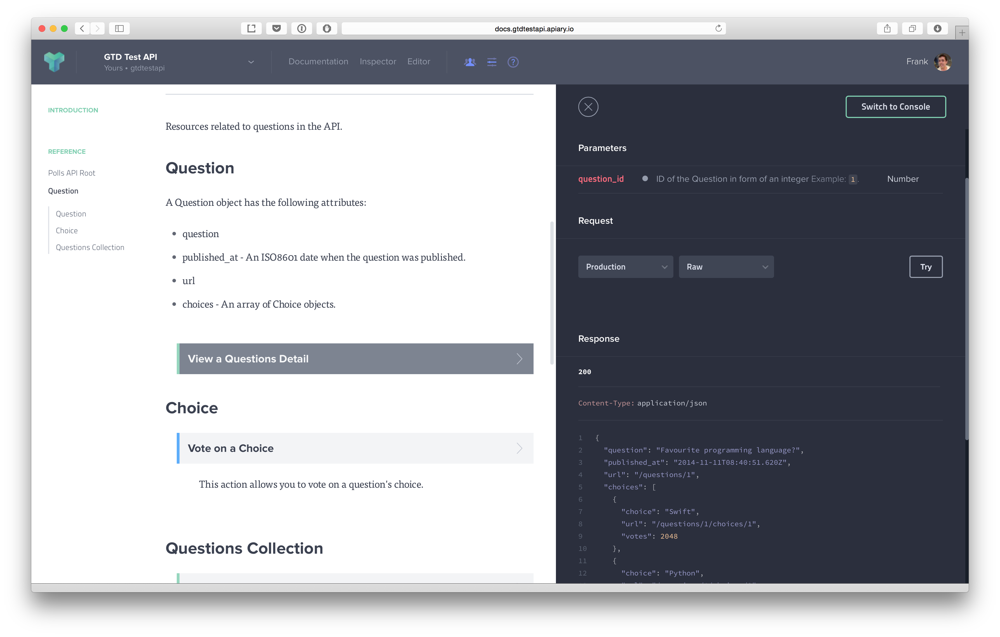
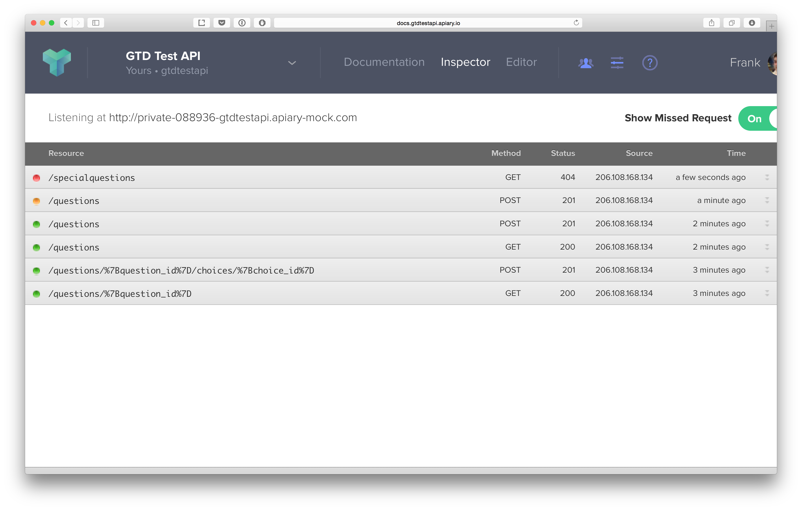
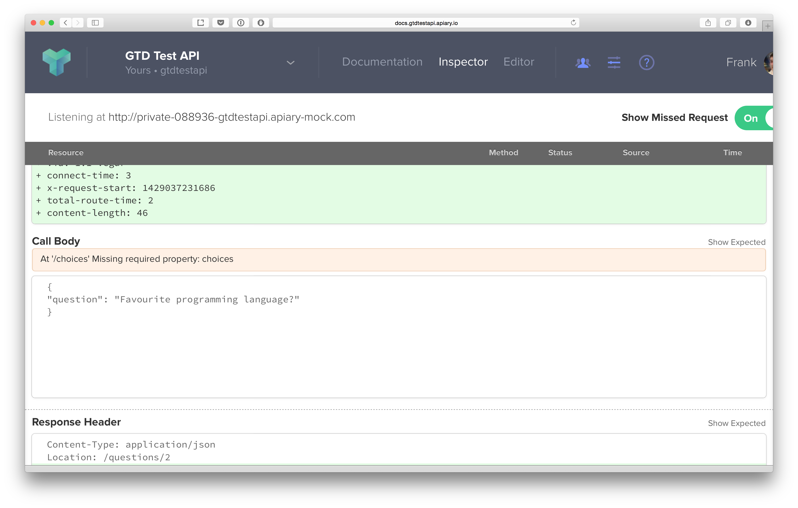

##  Mocking as a service with
# Apiary.io

---

# Impress your clients with this one simple trick!

---

# Why I love Apiary.io

- API Documentation
- API Mocking
- API Testing
- API Collaboration

---

---

# Documentation

---

####Yaaaaay... Documentation...

---

# API Blueprint

(Essentially, Markdown for APIs)

---

# API Blueprint (Step 1) - Give your API a name

    # Polls

    Polls is a simple API allowing consumers 
    to view polls and vote in them.

---

# API Blueprint (Step 2) - Create a group of resources

    # Group Questions

    Resource related to questions in the API.

---

# API Blueprint (Step 3a) - Add a resource!

    ## Question Collection [/questions]

---

# API Blueprint (Step 3b) - With parameters? 

    ## Question [/questions/{question_id}]

    + Parameters
        + question_id (number) ... ID of the Question in form of an integer
 
---

# API Blueprint (Step 4a) - Add actions!

    ### List All Questions [GET]

---

# API Blueprint (Step 4b) - With a response? 

    + Response 200 (application/json)
        [
            {
                "question": "Favourite programming language?",
                "published_at": "2014-11-11T08:40:51.620Z",
                "url": "/questions/1",
                "choices": [
		    ...
                ]
            },
	    ...
        ]

---

# API Blueprint (Step 4c) - With a request? 

    ### Create a New Question [POST]

    + Request (application/json)
            {
                "question": "Favourite programming language?",
                "choices": [
                    "Swift",
                    "Python",
                    "Objective-C",
                    "Ruby"
                ]
            }

---

# API Blueprint (Step 4d) - With practically nothing?

    ### Delete [DELETE]

    + Response 204

---

---

# Mocking

---

# Mocking

- Apiary.io creates a mock server using your API Blueprint.
- This means you instantly get a server against which you can make calls and get responses.
- **http://private-088936-gtdtestapi.apiary-mock.com**

---

# Testing

---

# Testing

- You can get Feedback via the Inspector
- Easy to see what worked, what didn't work, and what ehhhhh kinda worked

---

---

---

# Collaboration

---

# Collaboration

- Apiary is built for collaboration
- 2 types of users: viewers and editors
- Viewers can leave comments on the documentation
- Editors can straight up change the spec

---

# Other cool stuff

---

# Other cool stuff

- Support for publicly available API specs
- A bunch of things integrate with API Blueprint (like Paw!)
- Auto push/pull changes to Github
- And all this stuff is free!

---

# Thanks!
### @frankacy

---

# Questions?

---
